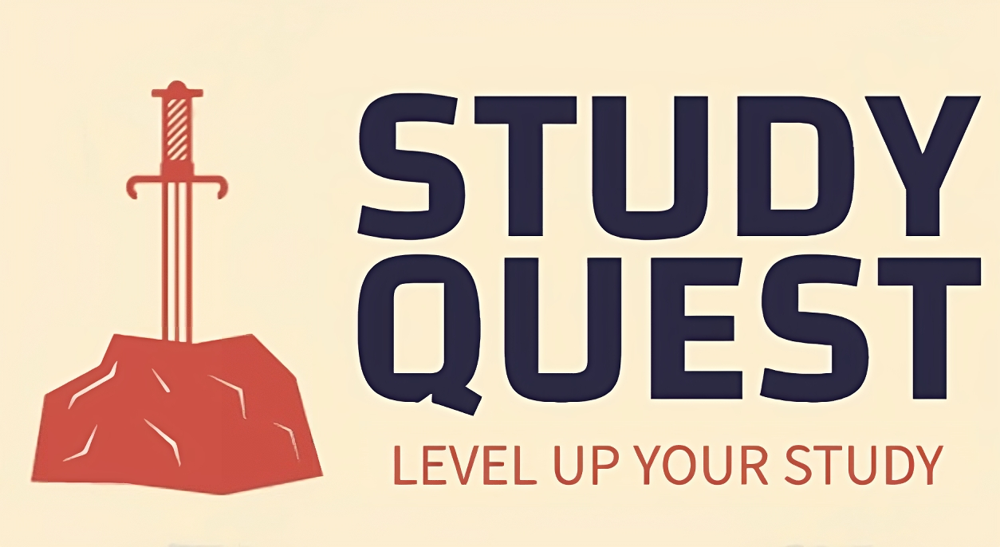

# Study Quest

> Making studying fun and interactive through gaming!

-   [About](#about)
-   [Installation](#installation)
-   [Getting help](#getting-help)
-   [Programming](#programming)
-   [Contact](#contact)

## About

Study Quest combines studying and gaming to encourage focus and productivity. We manage to do this by rewarding the user with in-game achievements and items. Studying more unlocks better items, which are used in battles against monsters. Unlike other game-and-study websites, progress and achievements will be saved rather than restarted. Study Quest is the perfect way to make studying fun and interactive.

## Installation

Study Quest runs on Windows, Linux, and Mac.

View the [system manual][] to how to run the Study Quest on your system.

## Getting help

Having trouble with Study Quest?

We have a [user guide][] to help with your Study Quest journey. User guide feature a step-by-steo walkthough on how to use the Study Quest.

## Programming

Study Quest is a Django web app written in Python and HTML-CSS-Javascript. There is also a game in Study Quest written in GDScript on Godot. We are using the HTML Export feature of Godot to run the game on web app.

## Contact

If you need further assistance or have any questions, feel free to reach out to our team:

-   Ali Ural: <asu25@drexel.edu>
-   Jordyn Carrel: <jmc834@drexel.edu>
-   Samay Patel: <snp325@drexel.edu>
-   Nicole Farrel:

[user guide]: https://gitlab.cci.drexel.edu/fds23/61/team-15/study-game/-/blob/main/UserGuide.md
[system manual]: https://gitlab.cci.drexel.edu/fds23/61/team-15/study-game/-/blob/main/SystemManual.md
