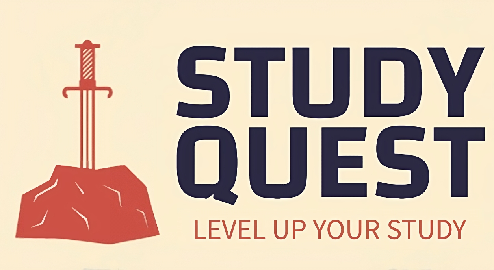
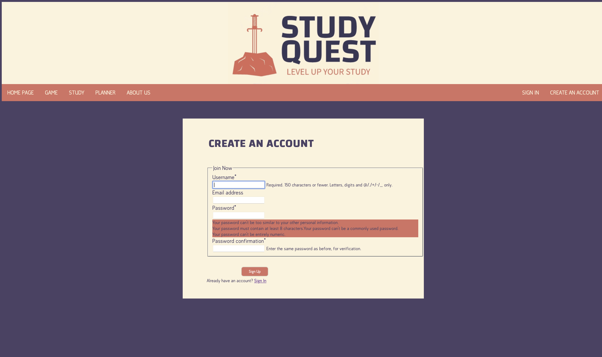
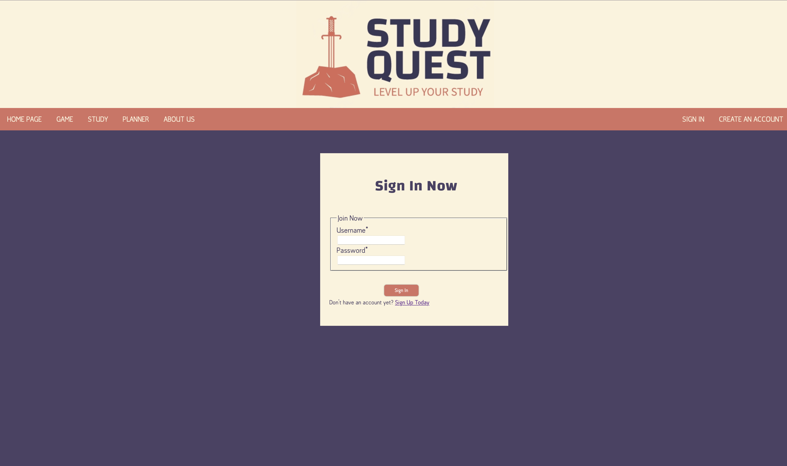
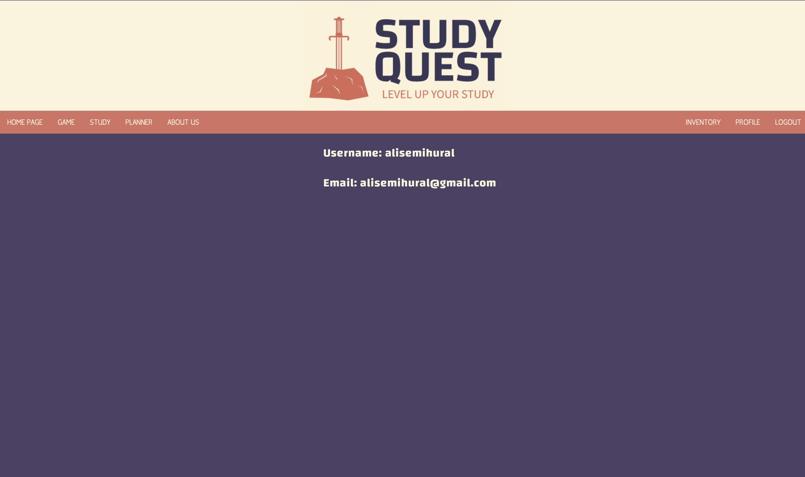
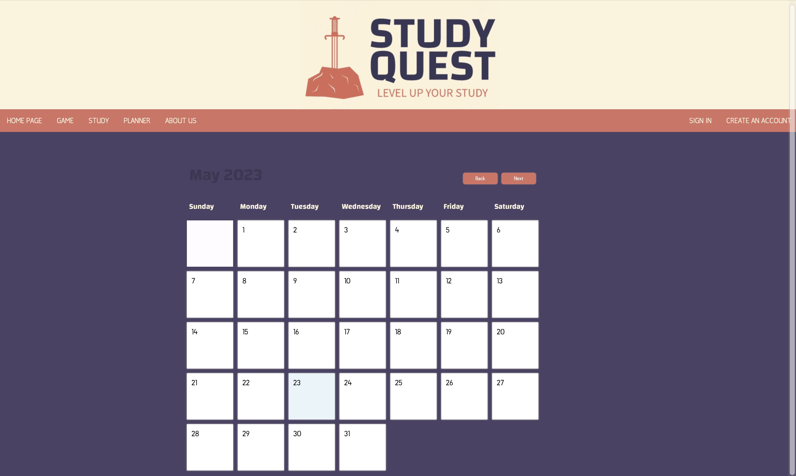
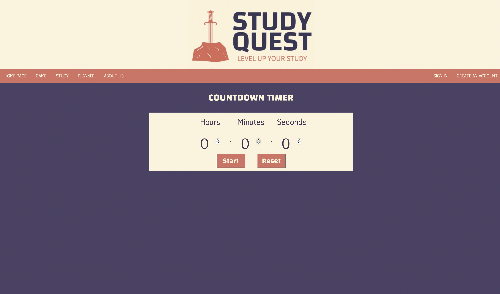
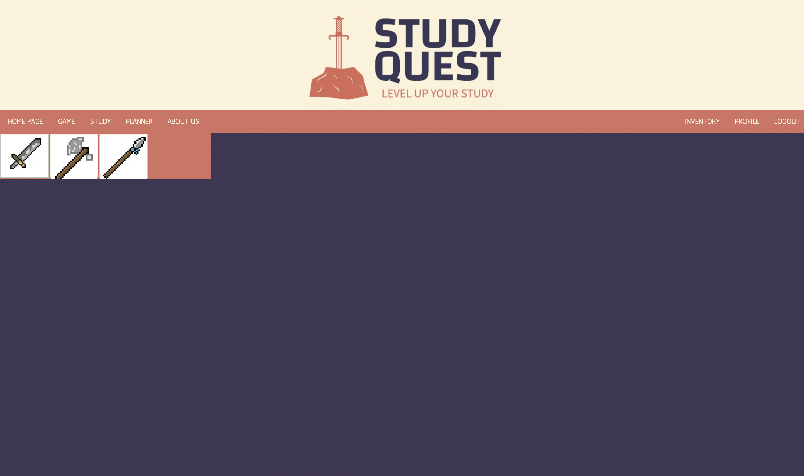
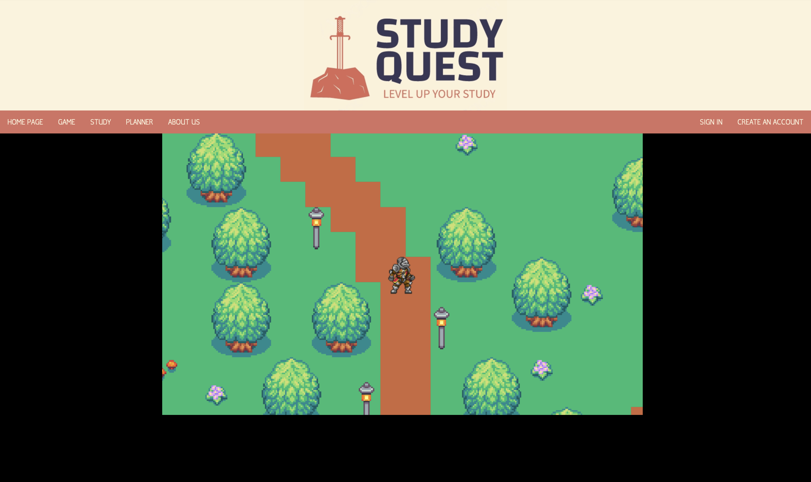

# Study Quest User Guide

- Welcome to the Study Quest! This user guide will provide you with a step-by-step walkthrough of the features and functionalities of our platform, designed to make studying more interactive and enjoyable. Let's get started!

## 1. Account Creation:
- Visit our website.
- Click on the "Create an Account" button to create a new account.
- Fill in the required details, such as your name, email address, and password.
- Click on the "Create Account" button to complete the registration process.
(img/createAccount.png)

## 2. Logging In:
- Visit our website.
- Click on the "Log In" button.
- Enter your registered email address and password.
- Click on the "Log In" button to access your account.

## 3. Profile:
- Upon logging in, you will be redirected to home, by clicking the "Profile" button, you will be directed to your personalized profile page.
- The dashboard provides an overview of account information.
- Take some time to familiarize yourself with the different sections of the dashboard.

## 4. Planing Study:
- Get into the planning calendar by clicking the "Plan" button.
- Choose the day you want to study from the calendar, and click on it.
- A add new section menu will appear, choose the name and time of the study section.
- You succesfully planned your study! 

## 5. Study Timer:
- Explore the study timer by choosing different subjects you will study.
- Each topic contains a quizze after the study session, which timer hits to zero.
- Set the timer by changing hour, minute and second boxes.
- Study!

## 6. Collect Rewards:
- At the end of your study session, a loot box will appear for you.
- Click the "Open" button and collect your 3 randomly selected items as a reward for your study.
- You succesfully obtained your your items as a reward for hardwork!

## 7. Inventory:
- You can take a look at your inventory by clicking the "Inventory" button.
- The items you obtained from your stuides will appear in here.
- You can click on a item and can choose "Equip" button to use that item in in-game battles!

## 8. Character Personalization:
- Navigate to the gaming section of the website by clicking the "Game" button.
- Before getting into the game, a customization menu will appear for your in-game character.
- Click on the skin you would like to choose and click "Create" button to create your character!
- You can choose any skin you would like and use it in the game as your in-game avatar!

## 9. Game Section:
- Here, you will find a Turn-Based RPG game that you can use your items to battle against monsters!
- Explore the game world!
- When you ready to fight against some monsters, get into the arena.
- Fight and defeat as much monsters as you can with the items you gain from your studies!

Remember, Study Quest aims to make studying an engaging and rewarding experience. Make the most of the interactive study materials and games to enhance your knowledge and skills. Happy learning and gaming!
If you need any further assistance or have specific questions, feel free to reach out to our team at:

- Ali Ural, asu25@drexel.edu

- Jordyn Carrel, jmc834@drexel.edu

- Samay Patel, snp325@drexel.edu

- Nicole Farrel, nmf94@drexel.edu
